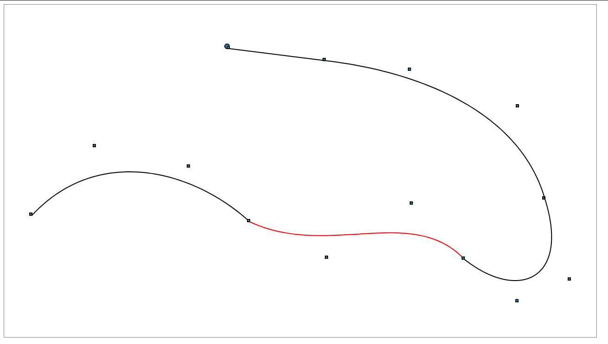

# Bezier editor

This repository contains a 2D canvas-based editor for Bezier curves. The editor allows linear, quadratic and cubic curves.

## Installation
### Requirements
In order to test the local code NodeJS and npm should be installed in the system.

### Installation steps
1. Install the dependecies:
```
npm i
```
2. Build and start the project:
```
npm run build
npm run start
```
This command shall respond with a local server url where the project is deployed and executed e.g., http://localhost:8081/

## User manual



### Keyboard
* Left and Right arrows: Curve selection. The selected curved will be highlighted on red.
* Space. Curve straightening.

### Mouse
* Left click on canvas: Add a new control point. Only 4 points as most per curve are allowed (cubic curve).
* Right click: Create a Bezier curve from the last added control points.
* Drag and drop on control points in the selected cruve: Control point edition.

## Exercise questions

### **How would your representation handle the support of editing path control points in our application? Which members would you expose to do that?**

For this particular scenario, having a simple method in which an 2D x,y position is passed retrieves in O(n) the nearest control point is more than enough. Because of the low number of points, the performance drop is not a problem in this case.

To overcome this, we should expose just the nearest point through this method.

### **How would your representation handle converting one of the path curved segments to a straight line? Which members would you expose to do that?**

The most direct way and probably the one I would choose is to transfomr the curve into a linear one by removing all the intermediate control points. In case we must keep the nature of the curve, I'd distribute evenly the remaining points along the segment between the first and last control points (in the middle if the curve is quadratic or in the quarters if the curve is cubic).

Besides the asked method, I'd create a new method in BezierCurve2 (straight) aimed at this procedure.

A possible solution for this exercise is implemented in the Typescript `./src/geometry` module.

### License
Copyright © 2023, [Alejandro Graciano]