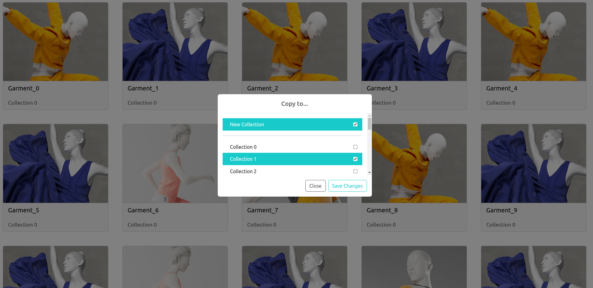

# Garment Collection

This repository contains a little example of interaction in React.

## Installation
### Requirements
In order to test the local code NodeJS and npm should be installed in the system.

### Installation steps
1. Install the dependecies:
```
npm i
```
2. Start the project:
```
npm run start
```
This command shall respond with a local server url where the project is deployed and executed e.g., http://localhost:3000/

## User manual



It's assumend that the screen shows the garment included in one user collection. By clicking the context menu on each card a dialog should appear asking for the targert collections where the garment will be copied. An alert will be shown depicting the result of the operation.

## Exercise questions

### **What props each of the components are receiving?**

Each component contains a `Props` interface contianing the minimal input properties for its operation.

### **How did you approach the composition of them together?**

The components are composed in a decoupled way by using several states handled by hooks.

### License
Copyright © 2023, [Alejandro Graciano]